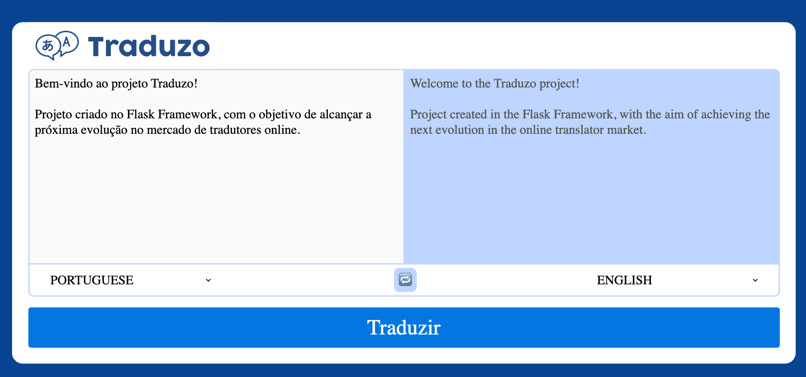

# Boas-vindas ao repositório do Projeto Traduzo!

O Traduzo é uma ferramenta de tradução de textos entre vários idiomas, utilizando Python com o Framework Flask, para criar uma aplicação Server Side. Ou seja, o Back-end (pela controller) fornecerá diretamente a camada View, para a pessoa usuária.



## Detalhes

<details>
<summary>🧑‍💻 Desenvolvimento</summary>

#### O que foi desenvolvido por mim:

* Conexão com o MongoDB no src/database/db.py
* classe LanguageModel em src/models/language_model.py
* método to_dict() da classe LanguageModel
* método de classe list_dicts() para a classe LanguageModel: retorna todos os idiomas como uma lista iterável
* Endpoint Tradutor, renderizando variáveis do Back-end no template index.html
* Tradução de Texto através do método POST
* Tradução reversa através do método POST utilizando o botão de reversão
* Teste para verificar o método list_as_json() da classe HistoryModel
* Endpoint que permite a listagem dos registros de histórico de traduções
* Método de excluir um histórico por meio do endpoint DELETE na rota /admin/history/<id>

Todas as outras funcionalidades e configurações foram providas pela instituição de ensino Trybe.

</details>

<details>
  <summary>📝 Habilidades trabalhadas </summary>

- Implementação de uma API utilizando arquitetura em camadas MVC;
- Docker para projetos Python;
- Conhecimentos de Orientação a Objetos no desenvolvimento WEB.
- Testes para APIs, garantindo a implementação dos endpoints;
- Interação com um banco de dados não relacional MongoDB;
- Desenvolvimento de páginas web Server Side.

</details>

----

## Preparando Ambiente

<details>

<summary>🐳 Subindo a aplicação</summary>

**[1]** Clone o repositório

* Use o comando: `git@github.com:linahsu/projeto-traduzo.git`.
* Entre na pasta do repositório que você acabou de clonar:
  * `cd projeto-traduzo`

**[2]** Crie o ambiente virtual para o projeto

```bash
python3 -m venv .venv && source .venv/bin/activate
```

**[3]** Instale as dependências

```bash
python3 -m pip install -r dev-requirements.txt
```

**Escolha uma opção:**

**[4 - Opção A]** Banco e Flask pelo Docker

```bash
docker compose up translate
```

- Recomendada: Dockerfile e Docker-compose já estão prontos para uso, para conectar o MongoDB e o Flask.

**[4 - Opção B]** Banco pelo Docker, Flask localmente pelo ambiente virtual

```bash
docker compose up -d mongodb

python3 src/app.py
```

**[5]** Acesse a aplicação pelo navegador na rota <http://127.0.0.1:8000/> caso utilize a padrão do projeto.

</details>

----

## Executando os Testes

<details>
<summary>🛠 Pytest pelo ambiente virtual (Recomendado) </summary>

Por uma melhor integração com o Vscode, e devido o ambiente virtual ser mais leve que um container, ainda é uma boa recomendação.

**[1]** Crie o ambiente virtual, e instale as dependências, suba o banco, conforme seção preparando ambiente

**[2]** Execute os testes

```bash
python3 -m pytest
```

</details>

<details>
<summary>🗳️ Pytest pelo Container Docker </summary>

**[1]** Execute o projeto conforme seção preparando ambiente

**[2]** Execute os testes diretamente, ou após acessar o sh do container

```bash
docker compose exec -it translate pytest
```

```bash
docker compose exec -it translate sh
```

- Atente-se a realizar um novo Build, sempre que alterar a instalação do container.

</details>